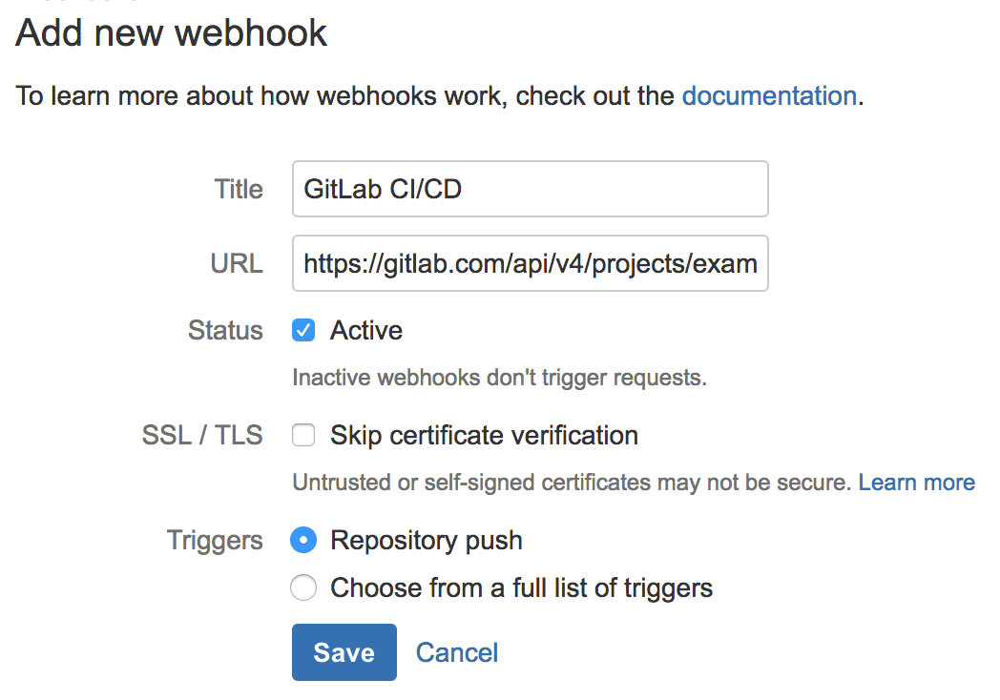
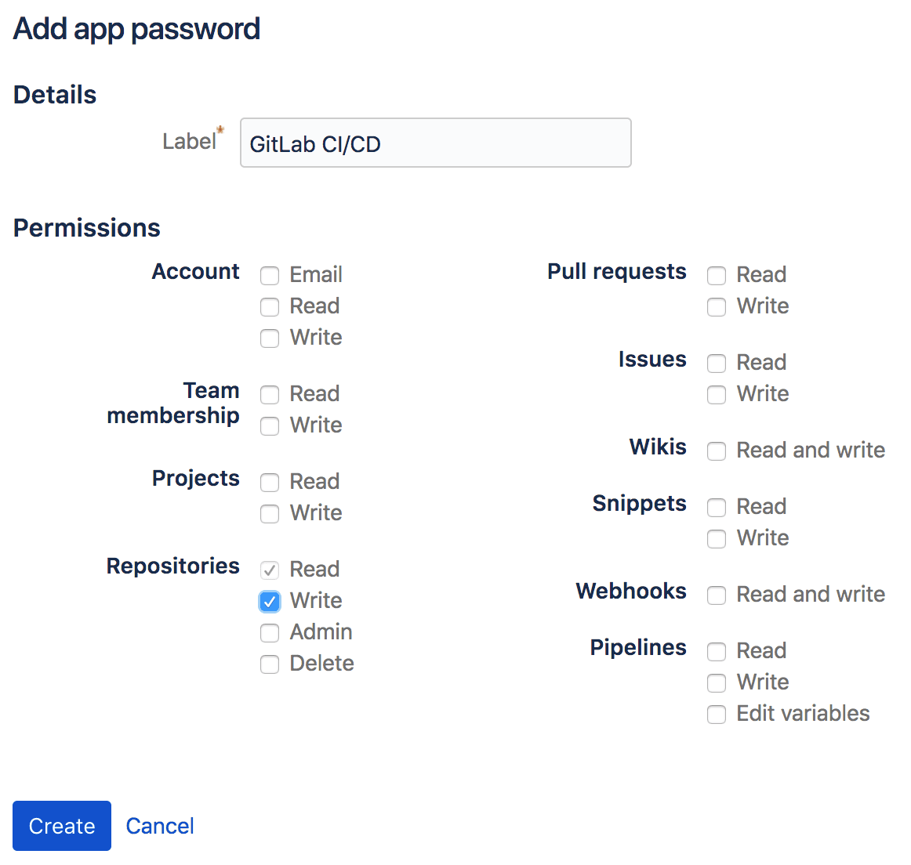

# Using GitLab CI/CD with a Bitbucket Cloud repository **(PREMIUM)**

GitLab CI/CD can be used with Bitbucket Cloud by:

1. Creating a [CI/CD project](index.md).
1. Connecting your Git repository via URL.

To use GitLab CI/CD with a Bitbucket Cloud repository:

1. In GitLab create a **CI/CD for external repository**, select **Repo by URL** and
   create the project.

   

   GitLab imports the repository and enables [Pull Mirroring](../../user/project/repository/repository_mirroring.md#pulling-from-a-remote-repository).

1. In GitLab create a
   [Personal Access Token](../../user/profile/personal_access_tokens.md)
   with `api` scope. This is used to authenticate requests from the web
   hook that is created in Bitbucket to notify GitLab of new commits.

1. In Bitbucket, from **Settings > Webhooks**, create a new web hook to notify
   GitLab of new commits.

   The web hook URL should be set to the GitLab API to trigger pull mirroring,
   using the Personal Access Token we just generated for authentication.

   ```plaintext
   https://gitlab.com/api/v4/projects/<PROJECT_ID>/mirror/pull?private_token=<PERSONAL_ACCESS_TOKEN>
   ```

   The web hook Trigger should be set to 'Repository Push'.

   

   After saving, test the web hook by pushing a change to your Bitbucket
   repository.

1. In Bitbucket, create an **App Password** from **Bitbucket Settings > App
   Passwords** to authenticate the build status script setting commit build
   statuses in Bitbucket. Repository write permissions are required.

   

1. In GitLab, from **Settings > CI/CD > Environment variables**, add variables to allow
   communication with Bitbucket via the Bitbucket API:

   `BITBUCKET_ACCESS_TOKEN`: the Bitbucket app password created above.

   `BITBUCKET_USERNAME`: the username of the Bitbucket account.

   `BITBUCKET_NAMESPACE`: set this if your GitLab and Bitbucket namespaces differ.

   `BITBUCKET_REPOSITORY`: set this if your GitLab and Bitbucket project names differ.

1. In Bitbucket, add a script to push the pipeline status to Bitbucket.

   NOTE:
   Changes made in GitLab are overwritten by any changes made
   upstream in Bitbucket.

   Create a file `build_status` and insert the script below and run
   `chmod +x build_status` in your terminal to make the script executable.

   ```shell
   #!/usr/bin/env bash

   # Push GitLab CI/CD build status to Bitbucket Cloud

   if [ -z "$BITBUCKET_ACCESS_TOKEN" ]; then
      echo "ERROR: BITBUCKET_ACCESS_TOKEN is not set"
   exit 1
   fi
   if [ -z "$BITBUCKET_USERNAME" ]; then
       echo "ERROR: BITBUCKET_USERNAME is not set"
   exit 1
   fi
   if [ -z "$BITBUCKET_NAMESPACE" ]; then
       echo "Setting BITBUCKET_NAMESPACE to $CI_PROJECT_NAMESPACE"
       BITBUCKET_NAMESPACE=$CI_PROJECT_NAMESPACE
   fi
   if [ -z "$BITBUCKET_REPOSITORY" ]; then
       echo "Setting BITBUCKET_REPOSITORY to $CI_PROJECT_NAME"
       BITBUCKET_REPOSITORY=$CI_PROJECT_NAME
   fi

   BITBUCKET_API_ROOT="https://api.bitbucket.org/2.0"
   BITBUCKET_STATUS_API="$BITBUCKET_API_ROOT/repositories/$BITBUCKET_NAMESPACE/$BITBUCKET_REPOSITORY/commit/$CI_COMMIT_SHA/statuses/build"
   BITBUCKET_KEY="ci/gitlab-ci/$CI_JOB_NAME"

   case "$BUILD_STATUS" in
   running)
      BITBUCKET_STATE="INPROGRESS"
      BITBUCKET_DESCRIPTION="The build is running!"
      ;;
   passed)
      BITBUCKET_STATE="SUCCESSFUL"
      BITBUCKET_DESCRIPTION="The build passed!"
      ;;
   failed)
      BITBUCKET_STATE="FAILED"
      BITBUCKET_DESCRIPTION="The build failed."
      ;;
   esac

   echo "Pushing status to $BITBUCKET_STATUS_API..."
   curl --request POST "$BITBUCKET_STATUS_API" \
   --user $BITBUCKET_USERNAME:$BITBUCKET_ACCESS_TOKEN \
   --header "Content-Type:application/json" \
   --silent \
   --data "{ \"state\": \"$BITBUCKET_STATE\", \"key\": \"$BITBUCKET_KEY\", \"description\":
   \"$BITBUCKET_DESCRIPTION\",\"url\": \"$CI_PROJECT_URL/-/jobs/$CI_JOB_ID\" }"
   ```

1. Still in Bitbucket, create a `.gitlab-ci.yml` file to use the script to push
   pipeline success and failures to Bitbucket.

   ```yaml
   stages:
     - test
     - ci_status

   unit-tests:
     script:
       - echo "Success. Add your tests!"

   success:
     stage: ci_status
     before_script:
       - ""
     after_script:
       - ""
     script:
       - BUILD_STATUS=passed BUILD_KEY=push ./build_status
     when: on_success

   failure:
     stage: ci_status
     before_script:
       - ""
     after_script:
       - ""
     script:
       - BUILD_STATUS=failed BUILD_KEY=push ./build_status
     when: on_failure
   ```

GitLab is now configured to mirror changes from Bitbucket, run CI/CD pipelines
configured in `.gitlab-ci.yml` and push the status to Bitbucket.

<!-- ## Troubleshooting

Include any troubleshooting steps that you can foresee. If you know beforehand what issues
one might have when setting this up, or when something is changed, or on upgrading, it's
important to describe those, too. Think of things that may go wrong and include them here.
This is important to minimize requests for support, and to avoid doc comments with
questions that you know someone might ask.

Each scenario can be a third-level heading, e.g. `### Getting error message X`.
If you have none to add when creating a doc, leave this section in place
but commented out to help encourage others to add to it in the future. -->
