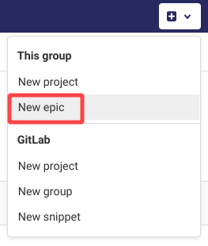
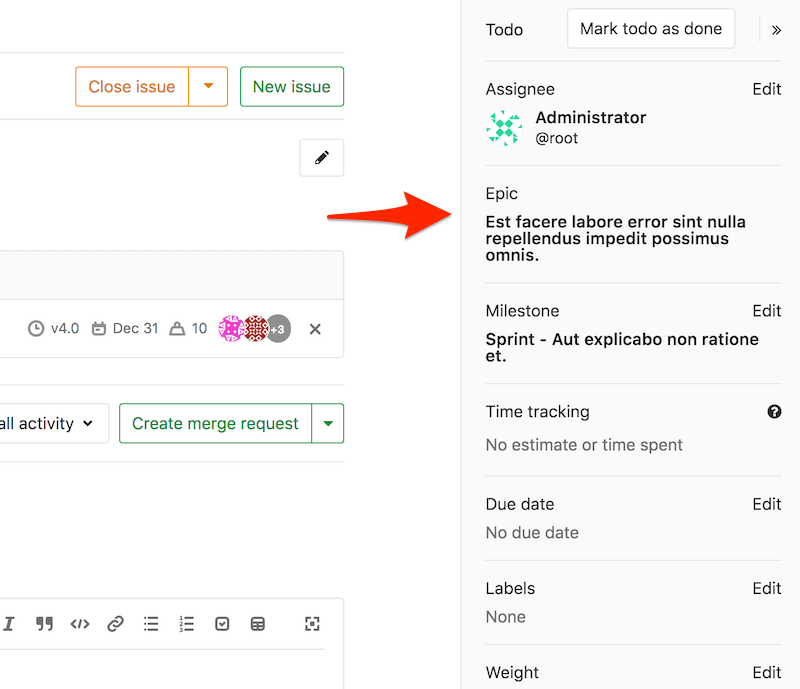
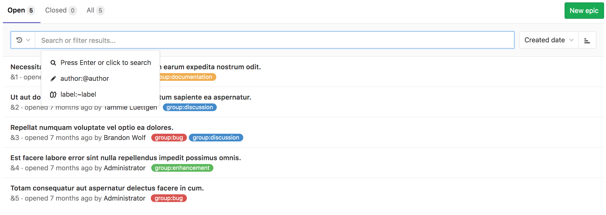
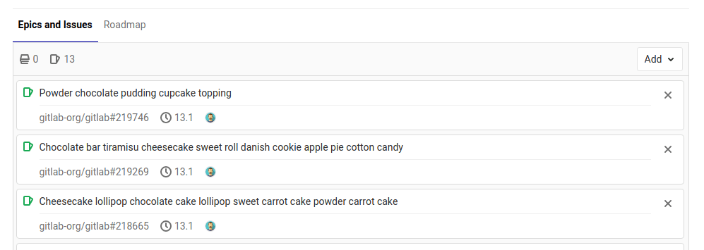

<!-- When adding a new h2 section here, remember to mention it in index.md#manage-epics -->

# Manage epics **(PREMIUM)**

This page collects instructions for all the things you can do with [epics](index.md) or in relation
to them.

## Create an epic

> - The New Epic form [introduced](https://gitlab.com/gitlab-org/gitlab/-/issues/211533) in [GitLab Premium](https://about.gitlab.com/pricing/) 13.2.
> - In [GitLab 13.7](https://gitlab.com/gitlab-org/gitlab/-/issues/229621) and later, the New Epic button on the Epics list opens the New Epic form.

To create an epic in the group you're in:

1. Get to the New Epic form:
   - From the **Epics** list in your group, select the **New Epic** button.
   - From an epic in your group, select the **New Epic** button.
   - From anywhere, in the top menu, select **New...** (**{plus-square}**) **> New epic**.

     

1. Fill in these fields:

   - Title
   - Description
   - [Confidentiality checkbox](#make-an-epic-confidential)
   - Labels
   - Start date
   - Due date

1. Select **Create epic**. You are taken to view the newly created epic.

## Edit an epic

After you create an epic, you can edit change the following details:

- Title
- Description
- Start date
- Due date
- Labels

To edit an epic's title or description:

1. Select the **Edit title and description** **{pencil}** button.
1. Make your changes.
1. Select **Save changes**.

To edit an epics' start date, due date, or labels:

1. Select **Edit** next to each section in the epic sidebar.
1. Select the dates or labels for your epic.

## Bulk-edit epics

You can edit multiple epics at once. To learn how to do it, visit
[Bulk editing issues, epics, and merge requests at the group level](../bulk_editing/index.md#bulk-edit-epics).

## Delete an epic

NOTE:
To delete an epic, you need to be an [Owner](../../permissions.md#group-members-permissions) of a group/subgroup.

When editing the description of an epic, select the **Delete** button to delete the epic.
A modal appears to confirm your action.

Deleting an epic releases all existing issues from their associated epic in the system.

## Close an epic

Whenever you decide that there is no longer need for that epic,
close the epic by:

- Selecting the **Close epic** button.

  

- Using a [quick action](../../project/quick_actions.md).

## Reopen a closed epic

You can reopen an epic that was closed by:

- Clicking the **Reopen epic** button.

  

- Using a [quick action](../../project/quick_actions.md).

## Go to an epic from an issue

If an issue belongs to an epic, you can navigate to the containing epic with the
link in the issue sidebar.

## Search for an epic from epics list page

> - Introduced in [GitLab Ultimate](https://about.gitlab.com/pricing/) 10.5.
> - [Moved](https://gitlab.com/gitlab-org/gitlab/-/issues/37081) to the [Premium](https://about.gitlab.com/pricing/) tier in GitLab 12.8.

You can search for an epic from the list of epics using filtered search bar (similar to
that of Issues and Merge Requests) based on following parameters:

- Title or description
- Author name / username
- Labels

To search, go to the list of epics and select the field **Search or filter results**.
It displays a dropdown menu, from which you can add an author. You can also enter plain
text to search by epic title or description. When done, press <kbd>Enter</kbd> on your
keyboard to filter the list.

You can also sort epics list by:

- Created date
- Last updated
- Start date
- Due date

Each option contains a button that can toggle the order between **Ascending** and **Descending**.
The sort option and order is saved and used wherever you browse epics, including the
[Roadmap](../roadmap/index.md).

## Make an epic confidential

> - [Introduced](https://gitlab.com/gitlab-org/gitlab/-/issues/213068) in [GitLab Premium](https://about.gitlab.com/pricing/) 13.0 behind a feature flag, disabled by default.
> - [Became enabled by default](https://gitlab.com/gitlab-org/gitlab/-/issues/224513) in [GitLab Premium](https://about.gitlab.com/pricing/) 13.2.
> - You can [use the Confidentiality option in the epic sidebar](https://gitlab.com/gitlab-org/gitlab/-/issues/197340) in GitLab [Premium](https://about.gitlab.com/pricing/) 13.3 and later.

If you're working on items that contain private information, you can make an epic confidential.

NOTE:
A confidential epic can only contain confidential issues and confidential child epics.

To make an epic confidential:

- **When creating an epic:** select the checkbox **Make this epic confidential**.
- **In an existing epic:** in the epic's sidebar, select **Edit** next to **Confidentiality** then
  select **Turn on**.

## Manage issues assigned to an epic

### Add a new issue to an epic

You can add an existing issue to an epic, or create a new issue that's
automatically added to the epic.

#### Add an existing issue to an epic

Existing issues that belong to a project in an epic's group, or any of the epic's
subgroups, are eligible to be added to the epic. Newly added issues appear at the top of the list of
issues in the **Epics and Issues** tab.

An epic contains a list of issues and an issue can be associated with at most one epic.
When you add a new issue that's already linked to an epic, the issue is automatically unlinked from its
current parent.

To add a new issue to an epic:

1. On the epic's page, under **Epics and Issues**, select the **Add** dropdown button.
1. Select **Add an existing issue**.
1. Identify the issue to be added, using either of the following methods:
   - Paste the link of the issue.
   - Search for the desired issue by entering part of the issue's title, then selecting the desired
     match (introduced in [GitLab 12.5](https://gitlab.com/gitlab-org/gitlab/-/issues/9126)).

   If there are multiple issues to be added, press <kbd>Spacebar</kbd> and repeat this step.
1. Select **Add**.

#### Create an issue from an epic

> [Introduced](https://gitlab.com/gitlab-org/gitlab/-/issues/5419) in GitLab 12.7.

Creating an issue from an epic enables you to maintain focus on the broader context of the epic
while dividing work into smaller parts.

To create an issue from an epic:

1. On the epic's page, under **Epics and Issues**, select the **Add** dropdown button.
1. Select **Add a new issue**.
1. Under **Title**, enter the title for the new issue.
1. From the **Project** dropdown, select the project in which the issue should be created.
1. Select **Create issue**.

### Remove an issue from an epic

You can remove issues from an epic when you're on the epic's details page.
After you remove an issue from an epic, the issue is no longer associated with this epic.

To remove an issue from an epic:

1. Select the **Remove** (**{close}**) button next to the issue you want to remove.
   The **Remove issue** warning appears.
1. Select **Remove**.

### Reorder issues assigned to an epic

> [Introduced](https://gitlab.com/gitlab-org/gitlab/-/issues/9367) in GitLab 12.5.

New issues appear at the top of the list in the **Epics and Issues** tab.
You can reorder the list of issues by dragging them.

To reorder issues assigned to an epic:

1. Go to the **Epics and Issues** tab.
1. Drag issues into the desired order.

### Move issues between epics **(ULTIMATE)**

> [Introduced](https://gitlab.com/gitlab-org/gitlab/-/issues/33039) in [GitLab Ultimate](https://about.gitlab.com/pricing/) 13.0.

New issues appear at the top of the list in the **Epics and Issues**
tab. You can move issues from one epic to another.

To move an issue to another epic:

1. Go to the **Epics and Issues** tab.
1. Drag issues into the desired parent epic.

### Promote an issue to an epic

> - [Introduced](https://gitlab.com/gitlab-org/gitlab/-/issues/3777) in [GitLab Ultimate](https://about.gitlab.com/pricing/) 11.6.
> - [Moved](https://gitlab.com/gitlab-org/gitlab/-/issues/37081) to [GitLab Premium](https://about.gitlab.com/pricing/) in 12.8.

If you have the necessary [permissions](../../permissions.md) to close an issue and create an
epic in the immediate parent group, you can promote an issue to an epic with the `/promote`
[quick action](../../project/quick_actions.md#quick-actions-for-issues-merge-requests-and-epics).
Only issues from projects that are in groups can be promoted. When you attempt to promote a confidential
issue, a warning is displayed. Promoting a confidential issue to an epic makes all information
related to the issue public as epics are public to group members.

When the quick action is executed:

- An epic is created in the same group as the project of the issue.
- Subscribers of the issue are notified that the epic was created.

The following issue metadata is copied to the epic:

- Title, description, activity/comment thread.
- Upvotes/downvotes.
- Participants.
- Group labels that the issue already has.
- Parent epic. **(ULTIMATE)**

### Use an epic template for repeating issues

You can create a spreadsheet template to manage a pattern of consistently repeating issues.

<i class="fa fa-youtube-play youtube" aria-hidden="true"></i>
For an introduction to epic templates, see [GitLab Epics and Epic Template Tip](https://www.youtube.com/watch?v=D74xKFNw8vg).

For more on epic templates, see [Epic Templates - Repeatable sets of issues](https://about.gitlab.com/handbook/marketing/strategic-marketing/getting-started/104/).

## Manage multi-level child epics **(ULTIMATE)**

### Add a child epic to an epic

To add a child epic to an epic:

1. Select the **Add** dropdown button.
1. Select **Add a new epic**.
1. Identify the epic to be added, using either of the following methods:
   - Paste the link of the epic.
   - Search for the desired issue by entering part of the epic's title, then selecting the desired
     match (introduced in [GitLab 12.5](https://gitlab.com/gitlab-org/gitlab/-/issues/9126)).

   If there are multiple epics to be added, press <kbd>Spacebar</kbd> and repeat this step.
1. Select **Add**.

### Move child epics between epics

> [Introduced](https://gitlab.com/gitlab-org/gitlab/-/issues/33039) in [GitLab Ultimate](https://about.gitlab.com/pricing/) 13.0.

New child epics appear at the top of the list in the **Epics and Issues** tab.
You can move child epics from one epic to another.
When you add a new epic that's already linked to a parent epic, the link to its current parent is removed.
Issues and child epics cannot be intermingled.

To move child epics to another epic:

1. Go to the **Epics and Issues** tab.
1. Drag epics into the desired parent epic.

### Reorder child epics assigned to an epic

> [Introduced](https://gitlab.com/gitlab-org/gitlab/-/issues/9367) in GitLab 12.5.

New child epics appear at the top of the list in the **Epics and Issues** tab.
You can reorder the list of child epics.

To reorder child epics assigned to an epic:

1. Go to the **Epics and Issues** tab.
1. Drag epics into the desired order.

### Remove a child epic from a parent epic

To remove a child epic from a parent epic:

1. Select the <kbd>x</kbd> button in the parent epic's list of epics.
1. Select **Remove** in the **Remove epic** warning message.
