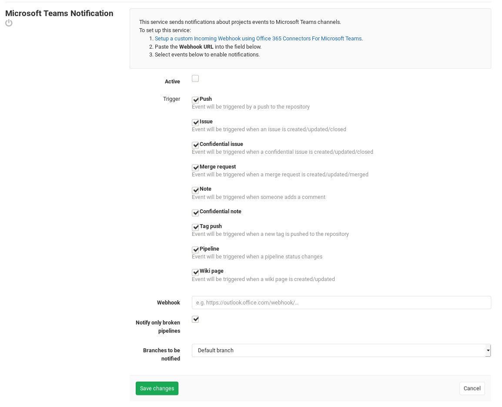

# Microsoft Teams service

## On Microsoft Teams

To enable Microsoft Teams integration you must create an incoming webhook integration on Microsoft
Teams by following the steps below:

1. Search for "incoming webhook" on the search bar in Microsoft Teams and select the
   **Incoming Webhook** item.

   

1. Click the **Add to a team** button.
1. Select the team and channel you want to add the integration to.
1. Add a name for the webhook. The name is displayed next to every message that
   comes in through the webhook.
1. Copy the webhook URL for the next steps.

Learn more about
[setting up an incoming webhook on Microsoft Teams](https://docs.microsoft.com/en-us/microsoftteams/platform/webhooks-and-connectors/how-to/connectors-using#setting-up-a-custom-incoming-webhook).

## On GitLab

After you set up Microsoft Teams, it's time to set up GitLab.

Navigate to the [Integrations page](overview.md#accessing-integrations)
and select the **Microsoft Teams Notification** service to configure it.
There, you see a checkbox with the following events that can be triggered:

- Push
- Issue
- Confidential issue
- Merge request
- Note
- Tag push
- Pipeline
- Wiki page

At the end fill in your Microsoft Teams details:

| Field | Description |
| ----- | ----------- |
| **Webhook** | The incoming webhook URL which you have to set up on Microsoft Teams. |
| **Notify only broken pipelines** | If you choose to enable the **Pipeline** event and you want to be only notified about failed pipelines. |

After you are all done, click **Save changes** for the changes to take effect.

