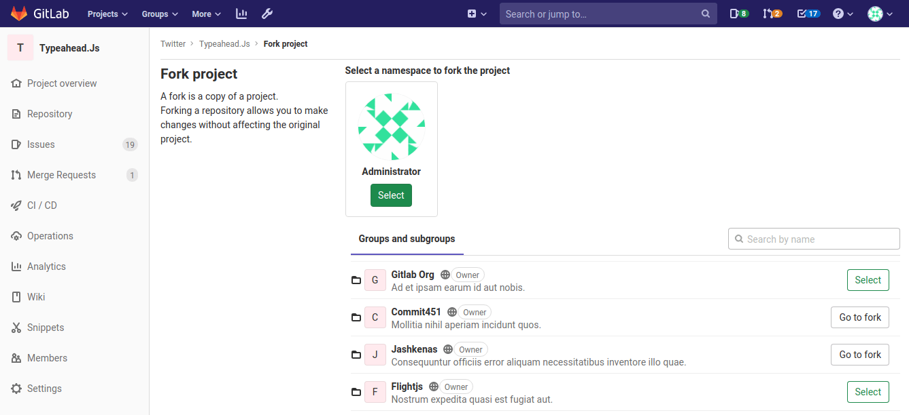

# Project forking workflow

Whenever possible, it's recommended to work in a common Git repository and use
[branching strategies](../../../topics/gitlab_flow.md) to manage your work. However,
if you do not have write access for the repository you want to contribute to, you
can create a fork.

A fork is a personal copy of the repository and all its branches, which you create
in a namespace of your choice. This way you can make changes in your own fork and
submit them through a merge request to the repository you don't have access to.

## Creating a fork

Forking a project is, in most cases, a two-step process.

1. On the project's home page, in the top right, click the **Fork** button.

   

1. Click a namespace to fork to. Only namespaces you have Developer and higher [permissions](../../permissions.md) for are shown.

   NOTE:
   The project path must be unique within the namespace.

   

The fork is created. The permissions you have in the namespace are the permissions you will have in the fork.

WARNING:
In GitLab 12.6 and later, when project owners [reduce a project's visibility](../../../public_access/public_access.md#reducing-visibility),
it **removes the relationship** between a project and all its forks.

WARNING:
When a public project with the repository feature set to "Members
only" is forked, the repository will be public in the fork. The owner
of the fork will need to manually change the visibility. This is being
fixed in [#36662](https://gitlab.com/gitlab-org/gitlab/-/issues/36662).

## Repository mirroring

You can use [repository mirroring](repository_mirroring.md) to keep your fork synced with the original repository. You can also use `git remote add upstream` to achieve the same result.

The main difference is that with repository mirroring your remote fork will be automatically kept up-to-date.

Without mirroring, to work locally you'll have to use `git pull` to update your local repository
with the upstream project, then push the changes back to your fork to update it.

WARNING:
With mirroring, before approving a merge request, you'll likely be asked to sync; hence automating it is recommended.

Read more about [How to keep your fork up to date with its origin](https://about.gitlab.com/blog/2016/12/01/how-to-keep-your-fork-up-to-date-with-its-origin/).

## Merging upstream

When you are ready to send your code back to the upstream project,
[create a merge request](../merge_requests/creating_merge_requests.md). For **Source branch**,
choose your forked project's branch. For **Target branch**, choose the original project's branch.

NOTE:
When creating a merge request, if the forked project's visibility is more restrictive than the parent project (for example the fork is private, the parent is public), the target branch will default to the forked project's default branch. This prevents potentially exposing the private code of the forked project.

Then you can add labels, a milestone, and assign the merge request to someone who can review
your changes. Then click **Submit merge request** to conclude the process. When successfully merged, your
changes are added to the repository and branch you're merging into.

## Removing a fork relationship

You can unlink your fork from its upstream project in the [advanced settings](../settings/index.md#removing-a-fork-relationship).
